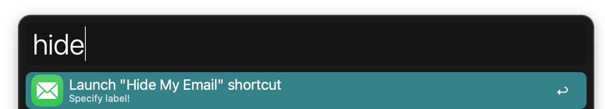
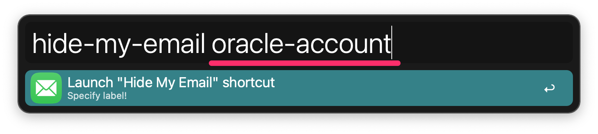
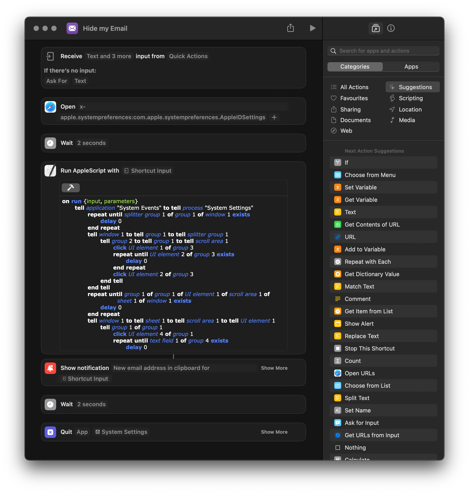
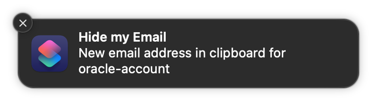

# apple-hide-my-email-shortcut-alfred

Apple's iCloud "Hide My Email" Shortcut and Alfred workflow

## What is it?

Simple Apple shortcut as well as alfred workflow for generating aliased email addresses via Apple's "Hide My Email" service.

## Install the shortcut

1. Clone the repository
2. Install the apple shortcut from `shortcut` directory
3. Install the alfred workflow from `alfred` directory
4. Make sure to allow any missing accessibility privileges

## Compatibility

### Tested

- macOS Ventura 13.3.1
- alfred 5.0.6

## Attribution

The Apple Script that powers the shortcut's functionality was inspired by reddit post [https://www.reddit.com/r/shortcuts/comments/yp5817/shortcut_for_creating_a_new_hide_my_email_alias/](Shortcut for creating a new Hide My Email alias) by [u/b_leep's](https://www.reddit.com/user/b_leep/)

## Disclaimer

The Apple script uses macOS GUI elements and Apple may introduce breaking changes with newer updates. I will try to keep this up to date with newer macOS versions, but will not be my top priority.

## Screenshots

